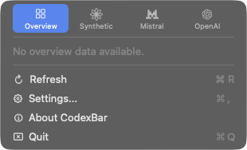

# Provider Presentation and Focus-Aware Icon — Design

**Status:** accepted on 2026-07-04
**Date:** 2026-07-01
**Issues:** [#1167](https://github.com/steipete/CodexBar/issues/1167),
[#780](https://github.com/steipete/CodexBar/issues/780)

## Decision summary

Two opt-in controls should share one presentation policy:

1. **Also show separately:** while Merge Icons is enabled, selected providers get stable provider status items in
   addition to the merged item.
2. **Merged icon source:** choose `Current selection`, `Highest usage`, or `Frontmost provider app`.

Provider pins affect status-item layout only. Frontmost-app matching affects the collapsed merged icon only. Neither
feature changes the selected menu tab, selected account, enabled providers, or Overview contents.

Implementation should ship provider pins and privacy-safe native app matching as separate PRs. Terminal-session
inference remains a later, separately reviewed opt-in.

## Current behavior

With multiple providers and Merge Icons enabled, CodexBar creates one merged status item and removes all provider
status items. `primaryProviderForUnifiedIcon()` chooses the merged icon from highest usage, the first Overview
provider, the selected menu provider, or the first enabled provider. Menu selection is persisted.



The current implementation spreads the binary merged/split assumption across status-item visibility, menu
attachment, icon animation, and observation signatures. Adding either request as another independent conditional
would let those paths disagree.

## Goals

- Let users pin important providers beside the merged icon without losing the unified menu.
- Let the collapsed merged icon follow a recognized, enabled frontmost provider app.
- Preserve explicit menu, account, and Overview selection.
- Keep provider data siloed and avoid new sensitive-data collection.
- Keep status-item identities stable across refreshes and focus changes.
- Use an event-driven monitor; no polling or idle battery cost.

## Non-goals

- Filtering providers out of the merged menu or Overview.
- A second provider-content subset; Overview selection remains the only content subset.
- Switching provider accounts based on focus.
- Reading window titles, terminal scrollback, command lines, working directories, environment variables, prompts, or
  shell history.
- Requiring Accessibility permission for the native-app MVP.
- Inferring a terminal tab's provider in the first implementation.

## User model

### Provider pins

Preferences → Display → Menu Bar gains **Also show separately** when Merge Icons is enabled and at least two
providers are enabled. Its Configure popover lists enabled providers in provider order.

- A pinned provider gets its own icon and provider menu.
- The provider remains in the merged switcher and Overview eligibility.
- The merged icon remains visible even when every enabled provider is pinned.
- Turning Merge Icons off restores existing all-separate behavior. Pins remain stored but dormant.
- Disabling a pinned provider hides its separate icon but preserves the pin for a later re-enable.

Pins are additive, not subtractive. This avoids a provider silently disappearing from the unified menu and keeps one
consistent place for cross-provider comparison.

### Merged icon source

Replace the current highest-usage toggle with a picker:

| Choice | Collapsed merged icon | Menu opens on |
| --- | --- | --- |
| Current selection | Existing resolver | Existing persisted selection or Overview |
| Highest usage | Existing closest-to-limit resolver | Existing persisted selection or Overview |
| Frontmost provider app | Recognized enabled provider; otherwise existing resolver | Existing persisted selection or Overview |

The existing `menuBarShowsHighestUsage = true` preference migrates to `highestUsage`; false migrates to
`currentSelection`. No new provider filter is introduced. This avoids overlap with #1781 and preserves the existing
Overview provider subset.

## Presentation policy

Introduce a pure model consumed by status-item lifecycle, menus, icons, animation, and tests:

```swift
struct StatusItemLayout: Equatable, Sendable {
    let showsMergedItem: Bool
    let separateProviders: [UsageProvider]
}

struct UnifiedIconContext: Equatable, Sendable {
    let source: UnifiedIconSource
    let focusedProvider: UsageProvider?
    let isMergedMenuOpen: Bool
}
```

`StatusItemLayout.resolve(...)` takes provider order, enabled providers, `mergeIcons`, stored pins, and fallback state.
It returns identities only; it never creates AppKit objects.

| State | Merged item | Separate items |
| --- | --- | --- |
| Merge off | hidden | all enabled providers, or existing fallback |
| Merge on, fewer than two displayable providers | existing single-provider behavior | existing provider/fallback item |
| Merge on, two or more displayable providers | visible | enabled pinned providers in provider order |

`updateVisibility()`, `rebuildProviderStatusItems()`, `attachMenus()`, icon observation signatures, and animation all
consume the same resolved layout. No path independently derives merged versus split visibility.

The merged item's content and animation inputs continue to include all enabled providers. Each separate provider item
uses only that provider. Existing render-signature caches prevent unchanged duplicate work.

## Focus-aware resolution

`FrontmostProviderMonitor` observes `NSWorkspace.didActivateApplicationNotification` and seeds itself from
`NSWorkspace.frontmostApplication` at startup. It publishes an in-memory `FocusMatch` only when a provider-owned
bundle-identifier mapping recognizes the application.

Provider mappings belong to provider descriptors rather than a central switch. A mapping is eligible only when its
provider is enabled. Unknown or disabled apps produce no override.

The frontmost match is an ephemeral input to unified-icon resolution:

```text
merged menu open ───────────────► keep current menu presentation stable
frontmost mode + enabled match ─► render matched provider on collapsed merged item
otherwise ──────────────────────► run the existing resolver unchanged
```

Focus changes never write `selectedMenuProvider`, `mergedMenuLastSelectedWasOverview`, account selection, or provider
configuration. When the menu closes, the latest focus match can affect the next collapsed render. Activation bursts
are coalesced on the main actor; no timer runs while the frontmost app is unchanged.

### Terminal boundary

`NSWorkspace` can identify Terminal, iTerm, or Warp as the frontmost app, but not which tab or pane is active. Treating
the terminal application itself as one provider would be incorrect.

If terminal inference is later approved, add provider-source adapters behind a second off-by-default preference. Each
adapter must return only a provider identity and confidence/source metadata. It must not retain or log raw terminal
content. Permission prompts, supported terminal applications, ambiguity behavior, and energy impact need their own
design and Tahoe proof before merge.

## Settings and migration

- `separateProvidersWhenMerged: [UsageProvider]`: normalized, de-duplicated provider order; unknown values ignored.
- `unifiedIconSource: UnifiedIconSource`: `currentSelection`, `highestUsage`, or `frontmostApp`.
- Read the legacy `menuBarShowsHighestUsage` value only when the new enum key is absent.
- Preserve pins for disabled providers; expose only enabled providers in the Configure popover.
- Turning features off does not delete their stored choices.

## Lifecycle and privacy

- Start `FrontmostProviderMonitor` only when `frontmostApp` is selected; stop and unregister when another source is
  selected or the controller shuts down.
- Store only the current matched provider and match source in memory.
- Do not persist frontmost-app history.
- Logs may contain the resolved provider and source category, never titles, arguments, paths, or raw application data.
- Native bundle matching uses public process metadata and requires no new permission.

## Failure and edge cases

| Case | Behavior |
| --- | --- |
| Pinned provider disabled | Separate item removed; pin retained dormant |
| Provider order changes | Separate items follow new provider order with stable identities |
| Every enabled provider pinned | Merged item plus every pinned provider remain visible |
| Merge Icons disabled | Existing all-separate behavior; pin controls disabled |
| One displayable provider remains | Existing single-provider behavior; no duplicate merged/provider pair |
| Focused app unrecognized | Existing merged-icon resolver |
| Focused provider disabled | Existing merged-icon resolver |
| Focus changes while menu open | Menu and icon presentation stay stable until close |
| App terminates without another activation | Re-evaluate `frontmostApplication`; fall back if unmatched |
| Screen/menu-bar reconstruction | Recreate identities from `StatusItemLayout`; do not discard stored pins |

## Testing

### Pure model

- Table-test `StatusItemLayout` for merge on/off, zero/one/many providers, every pin subset, provider reordering,
  disabled pins, fallback state, and all-providers-pinned.
- Table-test unified-icon precedence for all three sources, menu-open suppression, disabled matches, unknown apps,
  Overview selection, explicit provider selection, and missing snapshots.
- Test migration from `menuBarShowsHighestUsage` and round-trip normalization of provider pins.

### Controller seams

- Extend split lifecycle tests to prove stable status-item identities while pins, order, and enabled state change.
- Prove merged and pinned menus attach to the correct item and never share provider-only menu state.
- Prove animation and icon observation signatures include the resolved layout and focus match.
- Inject a fake workspace event source; do not activate real applications in unit tests.
- Prove monitor registration, coalescing, and shutdown without AppKit status-bar construction where possible.

### Tahoe visual and performance proof

Use a freshly packaged exact-head build in the macOS Tahoe VM:

1. Verify one merged item plus the selected provider pins.
2. Toggle pins, provider enabled state, Merge Icons, and provider order; capture redacted screenshots.
3. Switch between two mapped native apps and an unmapped app; verify only the collapsed merged icon changes.
4. Open the menu during focus switches; verify the selected tab/account and Overview stay fixed.
5. Profile repeated focus changes and merged-menu scrolling. Require no persistent idle timer, no status-item churn, and
   no regression from the native Overview scroller.

Run focused model/controller suites, `make check`, and `make test`. Keep all live proof free of account identity, usage
values, and unpublished provider/model data.

## Rollout

1. **Provider pins PR:** settings, pure layout model, controller adoption, tests, Tahoe screenshots.
2. **Native focus PR:** enum migration, provider mappings, event monitor, collapsed-icon precedence, energy proof.
3. **Terminal adapters:** only after a separate product/privacy decision.

Each implementation PR should remain independently reversible. Neither changes provider fetching or account state.

## Accepted owner decisions

| Decision | Recommendation | Alternative and cost |
| --- | --- | --- |
| Are pins additive? | Yes; pinned providers remain in merged content | Removing them fragments Overview/switcher semantics |
| Keep merged item when all providers are pinned? | Yes; explicit Merge Icons promise stays stable | Auto-hide makes layout change as the last pin toggles |
| Unified-icon setting shape | One three-choice picker | Multiple toggles create conflicting precedence |
| Focus effect | Collapsed merged icon only | Mutating selection makes focus fight explicit user state |
| First focus scope | Native provider apps only | Terminal inference adds privacy, permission, and ambiguity work |
| Terminal follow-up | Separate off-by-default design | Bundling it blocks the privacy-safe MVP |

## Acceptance

The six recommendations above are approved. This spec is the bounded implementation contract; it intentionally
changes no runtime behavior.
